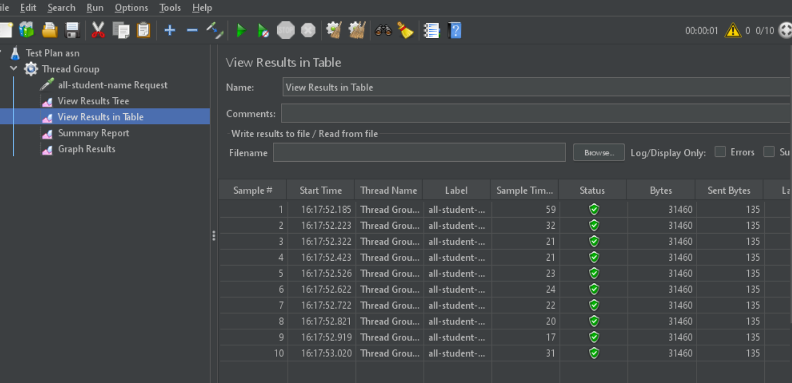
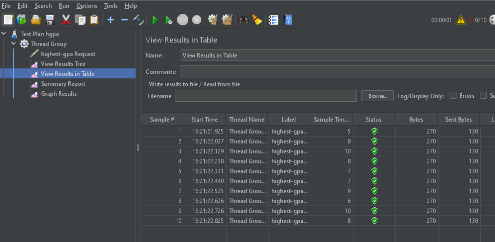

## Profiling results:
- /all-student-name
(GUI)
- Before optimization: 
- After optimization: 
(CLI)

- /highest-gpa
(GUI)
- Before optimization: 
- After optimization: 
(CLI)

## Conclusion:
From the table results attached in the readme of these two endpoints, 
it is clear that the optimizations done 
have reduced the sample time for each thread execution dramatically.

## Method optimizations for each endpoint
(/all-student) getAllStudentsWithCourses() 970 ms → 374 ms (>50%)
(/highest-gpa) findStudentWithHighestGpa() 120 ms →  70 ms (>40%)
(/all-student-name) joinStudentNames() 126 ms → 96 ms (>20%)
